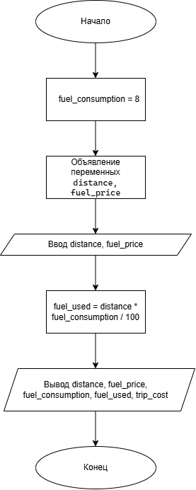

# Домашнее задание к работе 2

## Условие задачи

Написать и отладить программу стоимости поездки, исходя из известного расстояния и стоимости бензина.

## 1. Алгоритм и блок-схема

### Алгоритм
```
1. Начало.
2. Объявить константу fuel_consumption = 8 (л/100 км) — средний расход топлива автомобиля.
3. Ввести исходные данные:
   - distance — расстояние поездки (км).
   - fuel_price — стоимость 1 литра бензина (руб.).
4. Вычислить количество израсходованного топлива:
   fuel_used = distance * fuel_consumption / 100
5. Вычислить стоимость поездки:
   trip_cost = fuel_used * fuel_price
6. Вывести результаты расчётов с подстановкой всех значений в текст.
7. Конец.
```
### Блок-схема

## 2. Реализация программы
```
#define _CRT_SECURE_NO_WARNINGS
#include <stdio.h>
#include <locale.h>

int main() 
{
    setlocale(LC_ALL, "RUS");

    float fuel_consumption = 8.0f;
    float distance;
    float fuel_price;
    float fuel_used;
    float trip_cost;

    printf("Введите расстояние поездки (в км): ");
    scanf("%f", &distance);

    printf("Введите стоимость 1 литра бензина (в руб.): ");
    scanf("%f", &fuel_price);

    fuel_used = distance * fuel_consumption / 100.0f;
    trip_cost = fuel_used * fuel_price;

    printf("Результаты:\n");
    printf("Расстояние поездки:        %.2f км\n", distance);
    printf("Расход топлива:            %.2f л/100 км\n", fuel_consumption);
    printf("Стоимость 1 литра бензина: %.2f руб.\n", fuel_price);
    printf("Израсходовано топлива:     %.2f л\n", fuel_used);
    printf("Стоимость поездки:         %.2f руб.\n", trip_cost);
}
```
### 3. Результаты работы программы
```
Введите расстояние поездки (в км): 150
Введите стоимость 1 литра бензина (в руб.): 55

--- Результаты ---
Расстояние поездки:        150.00 км
Расход топлива:            8.00 л/100 км
Стоимость 1 литра бензина: 55.00 руб.
Израсходовано топлива:     12.00 л
Стоимость поездки:         660.00 руб.
```
### 4. Информация о разработчике

Дегтярева Полина, бИЦТ-262
